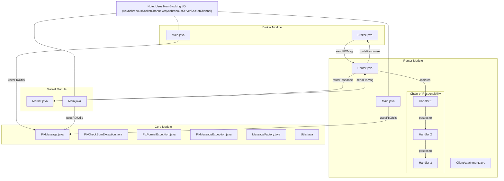

# Fixme

## Introduction
This project implements a FIX protocol router that facilitates communication between brokers and markets. It consists of three main modules: Broker, Market, and Router.

## System Architecture

## FIX Messages

FIX (Financial Information eXchange) messages are standardized messages used for electronic communication in the financial services industry. They facilitate the exchange of information related to securities transactions, including orders, executions, and confirmations.

### Structure of a FIX Message

A FIX message consists of a series of fields, each identified by a unique tag. The structure typically includes:
- **BeginString**: Indicates the version of the FIX protocol being used.
- **BodyLength**: Specifies the length of the message body.
- **MsgType**: Identifies the type of message (e.g., New Order, Execution Report).
- **SenderCompID**: The identifier for the sender of the message.
- **TargetCompID**: The identifier for the intended recipient.
- **CheckSum**: A checksum for message integrity.

Each field is represented as a tag-value pair, separated by the ASCII character 0x01 (SOH).

## Modules Overview

### Broker Module
The `Broker` class manages the connection to a router and facilitates communication between the broker and the router. It handles incoming messages, processes user input, and sends messages to the router.

#### Key Components:
- **AsynchronousSocketChannel**: Used for non-blocking I/O operations.
- **Methods**:
  - **start()**: Initializes the connection to the router.
  - **readId()**: Reads the broker ID from the router's response.
  - **readWriteHandler()**: Manages user input and message reading/writing.
  - **brokerInputReader(String _message)**: Parses user input and creates a FIX message to send to the router.

### Market Module
The `Market` class manages market operations, including processing buy and sell orders, maintaining stock levels, and communicating with the router.

#### Key Components:
- **AsynchronousSocketChannel**: Used for non-blocking I/O operations.
- **Methods**:
  - **start()**: Initializes the connection to the router.
  - **readId()**: Reads the market ID from the router's response.
  - **readHandler()**: Processes incoming messages from the router, handling buy and sell orders.
  - **marketOperations()**: Executes the logic for buying or selling instruments.

### Router Module
The `Router` class manages connections between brokers and markets, routing messages between them, and handling incoming requests.

#### Key Components:
- **AsynchronousServerSocketChannel**: Used to accept incoming connections from brokers and markets asynchronously.
- **Message Handlers**: Uses a chain of responsibility pattern with two handlers to process messages.
- **Methods**:
  - **acceptMarket()**: Listens for incoming market connections and registers them.
  - **acceptBroker()**: Listens for incoming broker connections and registers them.

### Main Module
The `Main` class serves as the entry point for the application. It initializes the `Router` and starts accepting connections from brokers and markets.

#### Key Components:
- **Router Initialization**: An instance of the `Router` class is created.
- **Thread Pool**: A fixed thread pool is created to handle incoming connections concurrently.

## Chain-of-Responsibility Pattern

The Chain-of-Responsibility pattern is a behavioral design pattern that allows an object to pass a request along a chain of potential handlers until one of them handles the request. This pattern promotes loose coupling by allowing multiple objects to handle a request without the sender needing to know which object will handle it.

### Implementation in the Router Module

In the Router module, the Chain-of-Responsibility pattern is utilized to manage message processing. The Router class contains multiple message handlers, each responsible for processing specific types of messages. When a message is received, it is passed through the chain of handlers, allowing each handler to either process the message or pass it to the next handler in the chain. This design allows for flexible and extensible message handling, making it easy to add new message types or modify existing handlers without affecting the overall system.

